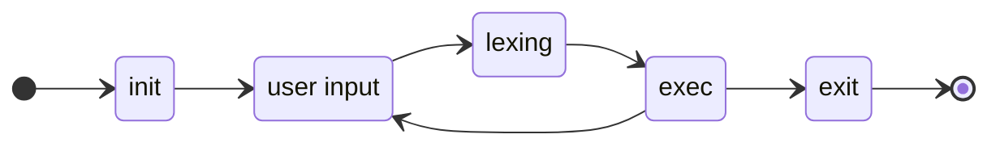

## Installation

### Clone
```bash
git clone https://github.com/octoross-42/minishell.git
cd minishell
make
```
### Execute
```bash
./minishell
```


# Project Workflow 


```mermaid
stateDiagram-v2
	direction LR
    state "init" as init
    state "user input" as input
    state "lexing" as lexing
    state "exec" as execution
    state "exit" as exit
	
	[*] --> init
	init --> input
	input --> lexing
	lexing --> execution
	execution --> exit
	execution --> input
	exit --> [*]

```
