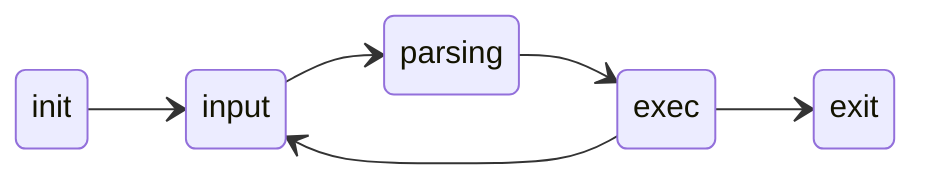
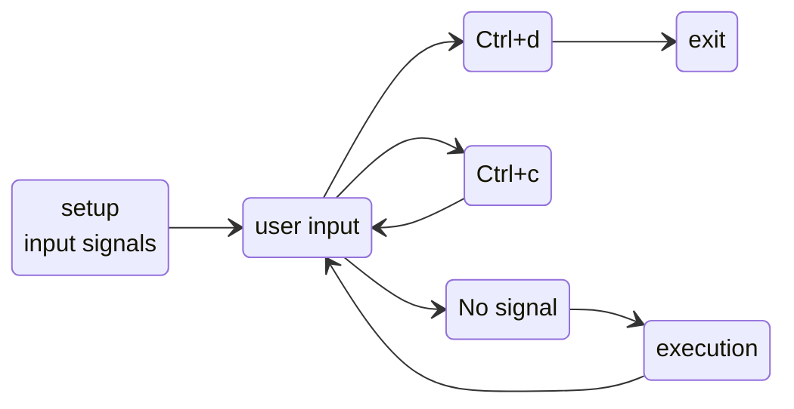
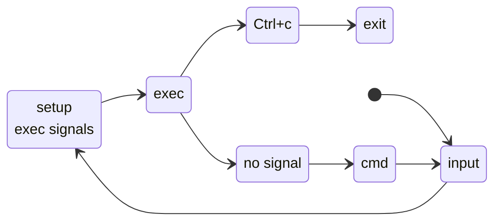
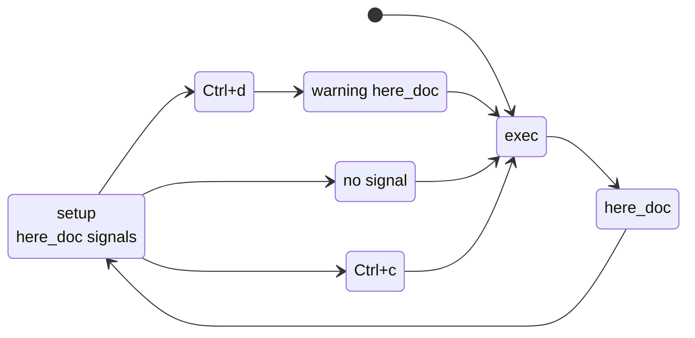

## Installation

### Clone
```bash
git clone https://github.com/octoross-42/minishell.git
cd minishell
```
### Execution
```bash
make
./minishell
```


### Compilation on Linux
**GCC et Make** :
   
   ```bash
   sudo apt update
   sudo apt install build-essential
```


# Project Workflow 

The way minishell works is quite simple, it is just as it follows :



Obviously, things will get more difficult... Let's dive into it !

## Signals

In minishell, we must handle `Ctrl+d` and `Ctrl+c` (and `Ctrl + \` but it doesn't do anything).
Signals are simple, here is doc for signals handling:
https://www.ibm.com/docs/en/zos/3.1.0?topic=functions-sigaction-examine-change-signal-action
On our part we'll focus on the structure of the program.
In this project, we set different use of signals for user input, execution and for here_docs.

(actually `Ctrl+d` isn't a signal but just an `EOF` (meaning end of file), but since we are considering the program's checkpoints, this will do)
### Input signals:



### Execution signals  

### Execution signals  


Now these are quite simple, but it really helps to have a global structure overview.